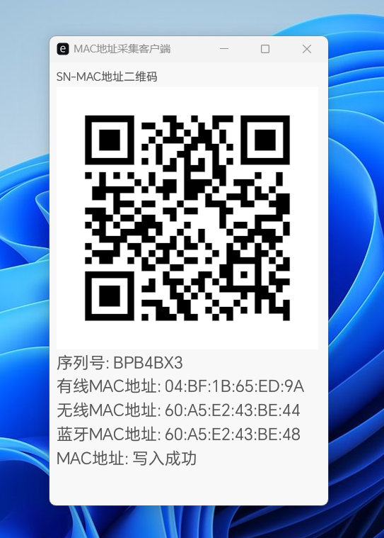

## macgui

 - 批量采集SN MAC地址客户端，数据展示为二维码并以`json`格式写入Redis。
 - 可配合 <https://github.com/spdrwcn/macjson> 导入Execl表格

 

## 用法

```
./macgui -h
macgui 1.4.0
h13317136163@163.com
MAC地址采集程序

USAGE:
    macgui.exe [OPTIONS]

FLAGS:
    -h, --help       Prints help information
    -V, --version    Prints version information

OPTIONS:
    -i, --ip <IP_ADDRESS>         Redis数据库地址 [default: redis://127.0.0.1:6379/0]
```

## 默认参数 多组参数逗号分隔
```
        (
            "wired",
            vec![
                vec!["gbe", "true"]
            ],
        ),
        (
            "wireless",   // 多组条件示例，任意一组匹配即可
            vec![
                vec!["wi-fi", "true"],
                vec!["wi-fi", "ax"],
                vec!["wireless", "true"]
            ],
        ),
        (
            "bluetooth",
            vec![
                vec!["bluetooth", "true"]
            ],
        ),
```

## 示例 
```
macgui -i redis://127.0.0.1:6379/0 
```

## 编译 

- 推荐使用`cross`

```
git clone https://github.com/spdrwcn/macgui.git
cd macgui 
cross build --release --target=x86_64-pc-windows-gnu
```
